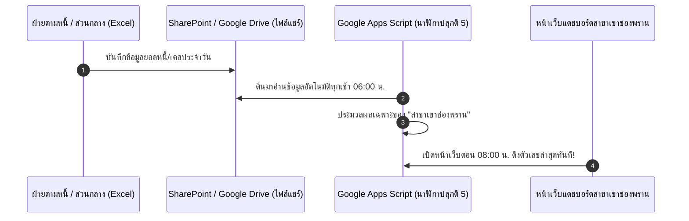

# 📘 คู่มือ: ระบบดึงข้อมูลยอดหนี้และเป้าหมายอัตโนมัติประจำวัน (Daily Auto-Sync Guide)
**สำหรับ: สาขาเขาช่องพราน (เขตราชบุรี)**

คู่มือนี้จะสอนวิธีการทำงานของระบบดึงข้อมูลอัตโนมัติทีละสเต็ปอย่างละเอียด เข้าใจง่าย โดยไม่ต้องพึ่งพาฝ่ายไอที (IT) ครับ

---

## 🏗️ 1. ภาพรวมการทำงาน (Architecture Workflow)

---

## 🚀 2. ขั้นตอนการตั้งค่า 3 สเต็ปง่าย ๆ (Setup Steps)

### สเต็ปที่ 1: ขอสิทธิ์เข้าชมไฟล์จากฝ่ายตามหนี้ (Viewer Role)
1. ติดต่อเพื่อนร่วมงานฝ่ายตามหนี้
2. ขอให้แชร์ไฟล์ Excel สรุปยอดหนี้มาที่บัญชีอีเมลของเรา โดยเลือกสิทธิ์เป็น **"อ่านอย่างเดียว (Can view / Read-only)"**
   > *หมายเหตุ: เป็นการแชร์ไฟล์ระหว่างเพื่อนร่วมงานตามปกติ ไม่ต้องเปิด Ticket ส่งไอที*

---

### สเต็ปที่ 2: ตั้งเวลานาฬิกาปลุกอัตโนมัติ (Time-driven Trigger ใน Google Apps Script)
1. เปิดโปรเจกต์ **Google Apps Script** ที่เชื่อมกับ Google Sheet ของสาขา
2. ที่แถบเมนูด้านบน เลือกฟังก์ชัน `setupDailyAutoSyncTrigger`
3. กดปุ่ม **"เรียกใช้ (Run)"** เพียงครั้งเดียว
4. ✅ **เสร็จสิ้น!** ระบบจะสร้างนาฬิกาปลุกอัตโนมัติที่จะตื่นมาทำงานทุกเช้าเวลา **06:00 น. - 07:00 น. ทุกวัน**

---

### สเต็ปที่ 3: เปิดหน้าเว็บแดชบอร์ดเพื่อดูข้อมูลอัปเดต
1. เมื่อพนักงานสาขาเปิดหน้าเว็บ [index.html](file:///c:/งานสาขา/index.html) ในตอนเช้า
2. สลับไปที่แท็บ **`3. แดชบอร์ดสรุปยอด`**
3. ตัวเลขยอดหนี้ค้าง x day, จำนวนราย, และ % NPL จะเป็นข้อมูลอัปเดตล่าสุดของวันนั้นทันทีโดยไม่ต้องอัปโหลดไฟล์เอง!

---

## 🛠️ 3. การทดสอบด้วยตนเอง (Manual Testing)
หากในระหว่างวันฝ่ายตามหนี้มีการอัปเดตยอดหนี้พิเศษ และเราต้องการดึงข้อมูลทันทีโดยไม่ต้องรอตอนเช้า:
1. ไปที่แท็บ **`3. แดชบอร์ดสรุปยอด`**
2. กดปุ่ม **"📥 นำเข้า .xlsx"** หรือกดปุ่ม **"รีเฟรชข้อมูล (Refresh)"**
3. ระบบจะซิงค์ข้อมูลใหม่ล่าสุดขึ้นจอให้ทันที

---

## 🔒 4. มาตรฐานความปลอดภัย
- **Read-Only:** ระบบเพียงแค่อ่านข้อมูล ไม่มีการแก้ไขไฟล์ต้นทาง
- **Branch Scope:** ดึงและกรองเฉพาะแถวของ **"สาขาเขาช่องพราน"** เท่านั้น
- **Zero IT Dependency:** ดำเนินการได้เองภายในทีมสาขา 100%
